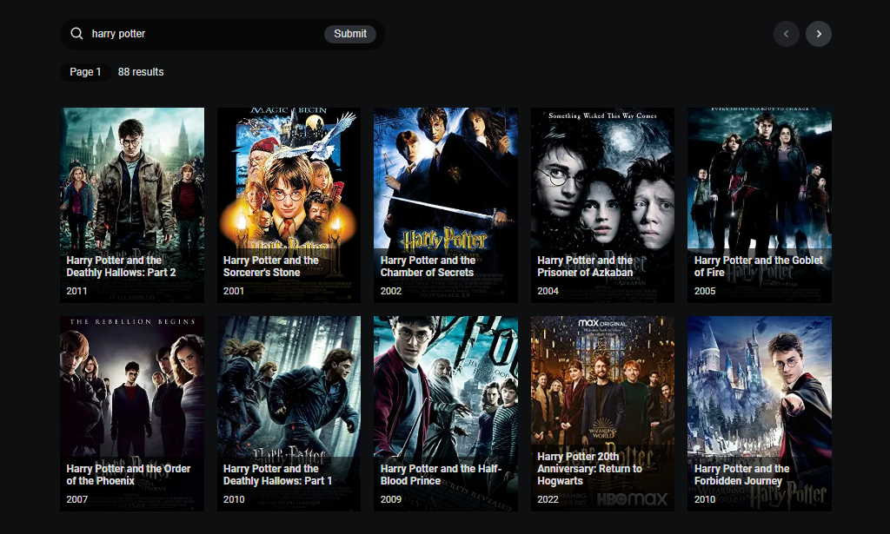
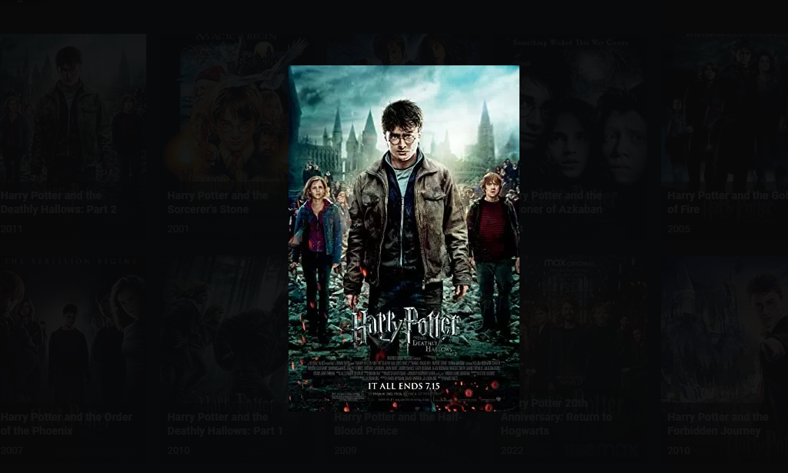
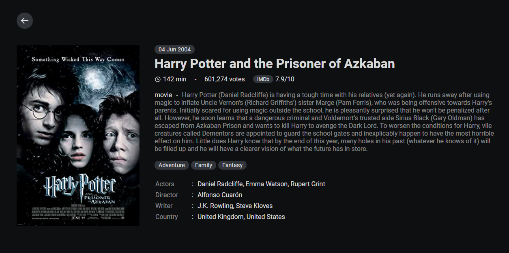

# Front End Pre-Test
Pre-test front end (React & Next.js) developer. 07/02/2022 - 09/02/2022

Tumpukan teknologi yang digunakan pada proyek ini, antara lain:

- [React](https://reactjs.org/)
- [Next.js](https://nextjs.org/)

# Mulai
~~~
$ git clone https://github.com/febriadj/frontend-pretest

$ cd frontend-pretest/ && code .
~~~

~~~js
module.exports = {
  reactStrictMode: true,
  images: {
    domains: ['m.media-amazon.com'],
  },
  env: {
    OMDB_API_KEY: 'http://www.omdbapi.com/?apikey=[yourkey]',
  },
}
~~~
Buka file `next.config.js` lalu daftarkan API key ke dalam environment variable.

~~~
$ npm install
~~~
Jalakan perintah `npm install` untuk menginstall seluruh dependencies

~~~
$ npm run dev
~~~
Jalankan aplikasi dalam mode development. kemudian buka http://localhost:3000 di browser.

# Tangkapan Layar

# Kontak
LinkedIn: [linkedin.com/in/febri-adji](https://www.linkedin.com/in/febri-adji)

Phone: +62 851-5670-3982\
Email: <iamfebriadji@gmail.com>